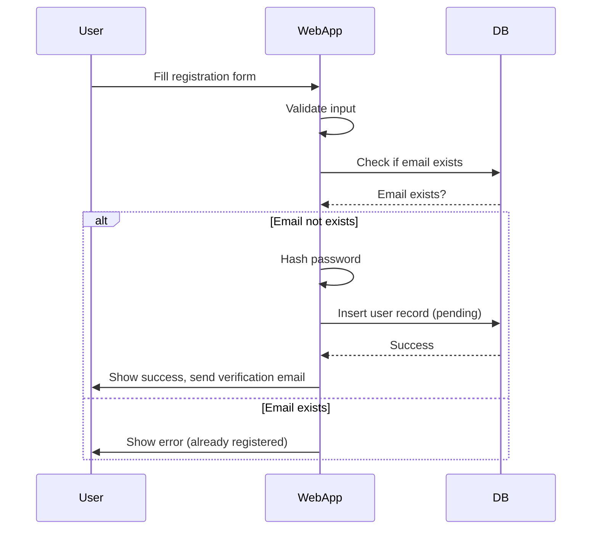
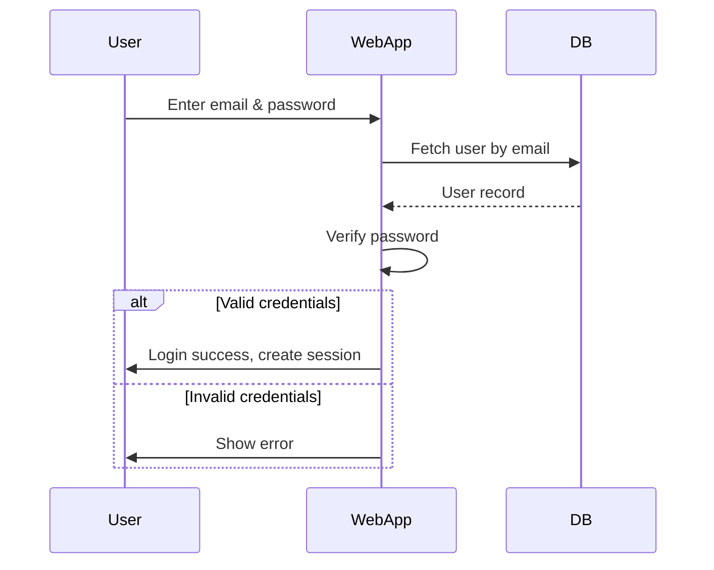
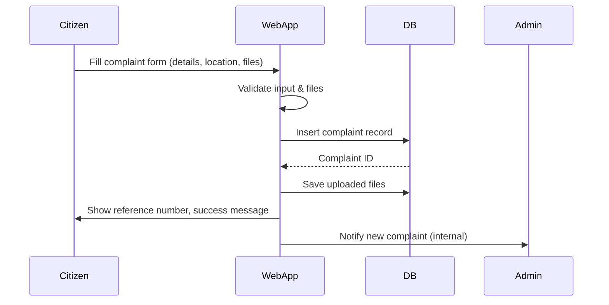
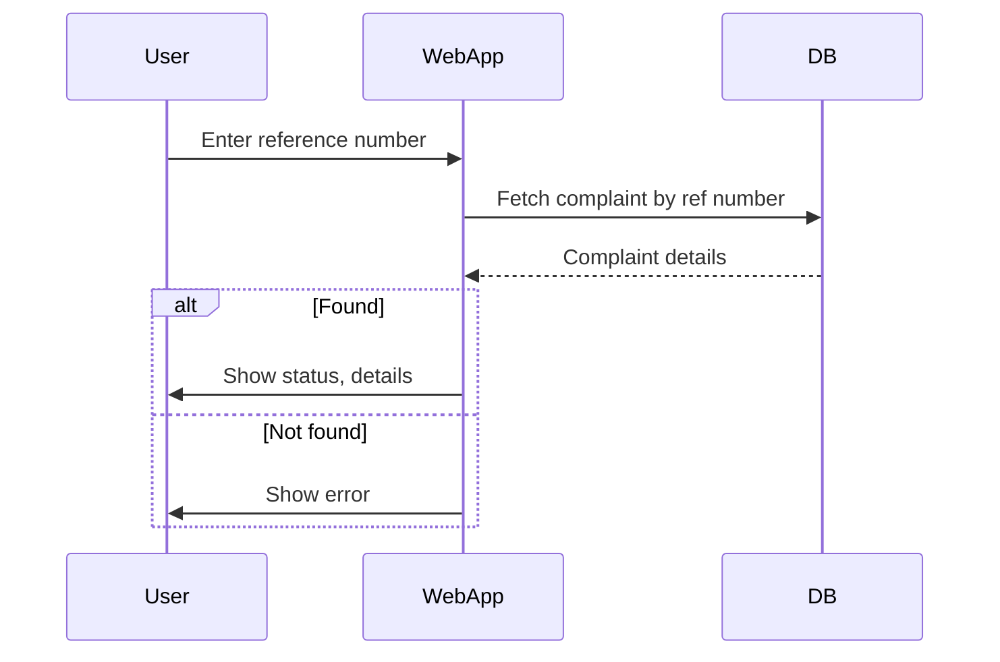
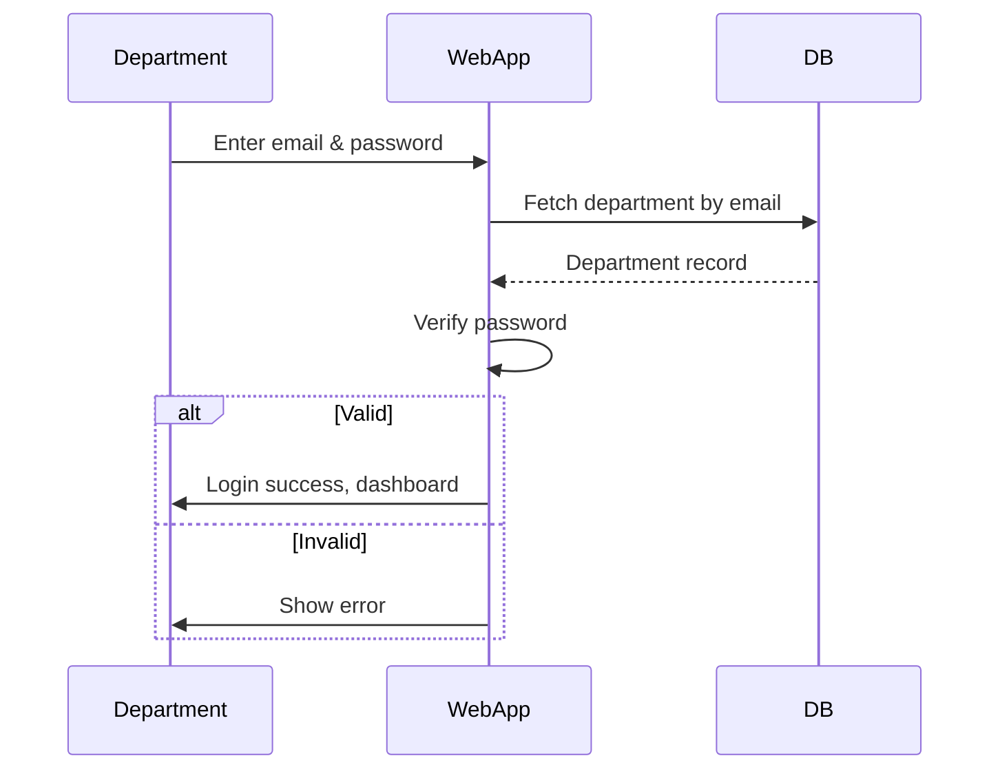
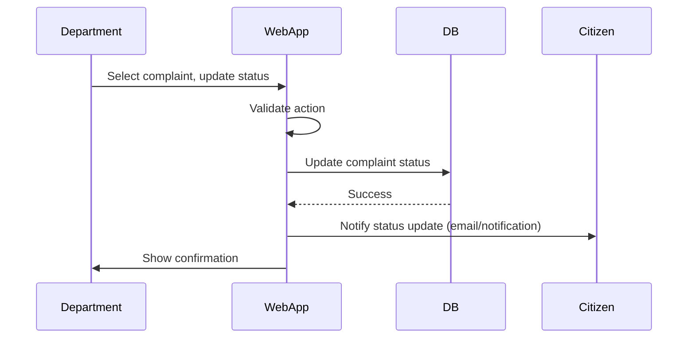
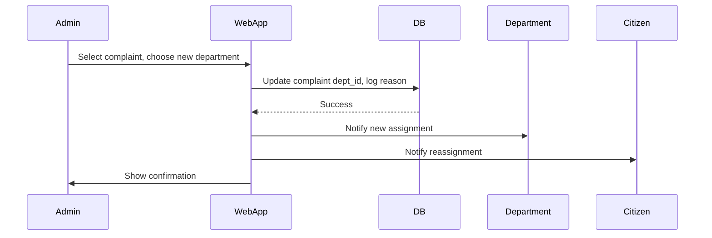
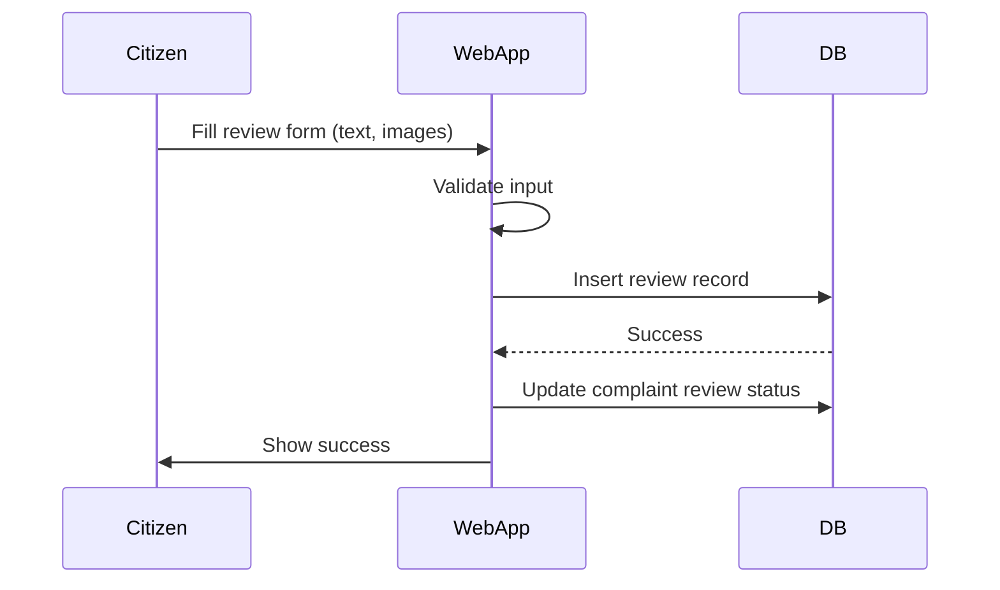
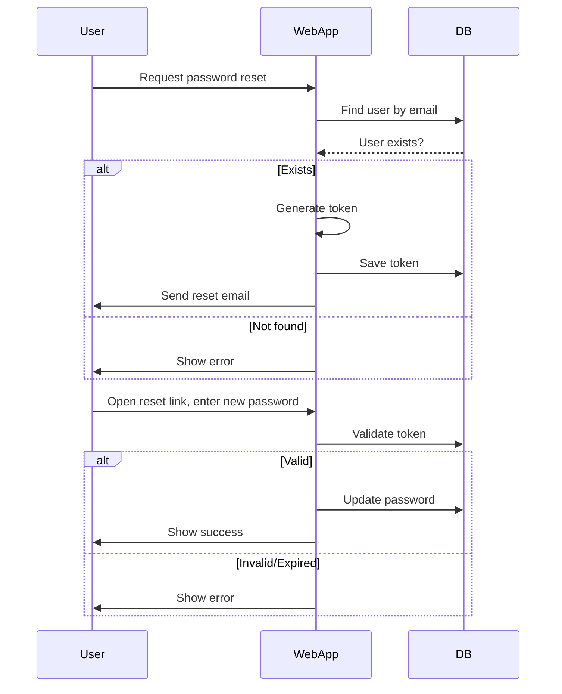
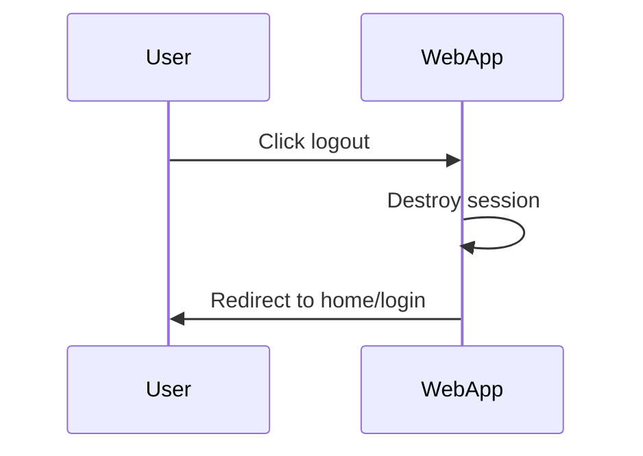

# FixLanka - Sequence Diagrams

This document contains all major sequence diagrams for the FixLanka system, using Mermaid syntax for easy visualization.

---

## 1. User Registration

---

## 2. User Login

---

## 3. Submit Complaint

---

## 4. Track Complaint Status

---

## 5. Department Login

---

## 6. Department Updates Complaint Status

---

## 7. Admin Reassigns Complaint

---

## 8. Submit Review

---

## 9. Password Reset

---

## 10. Logout

---

**Note:** These diagrams can be rendered using Mermaid.js or compatible Markdown viewers. They provide a clear, step-by-step visualization of the main interactions in the FixLanka system. 