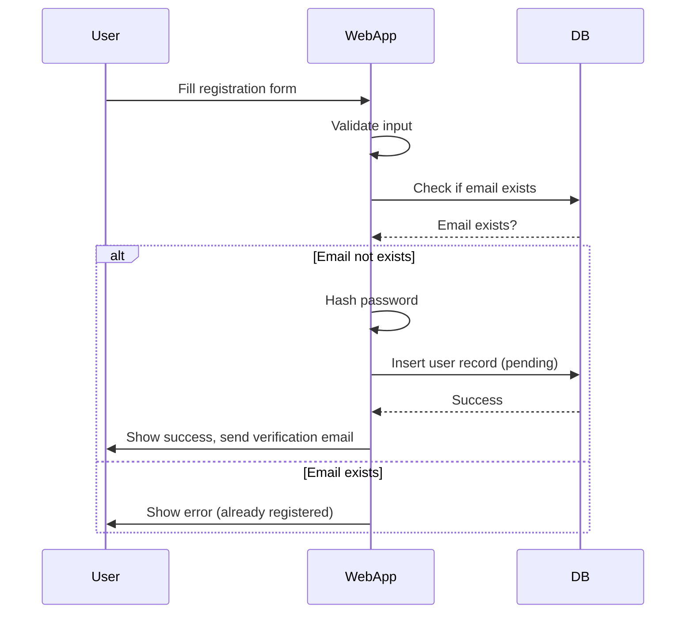
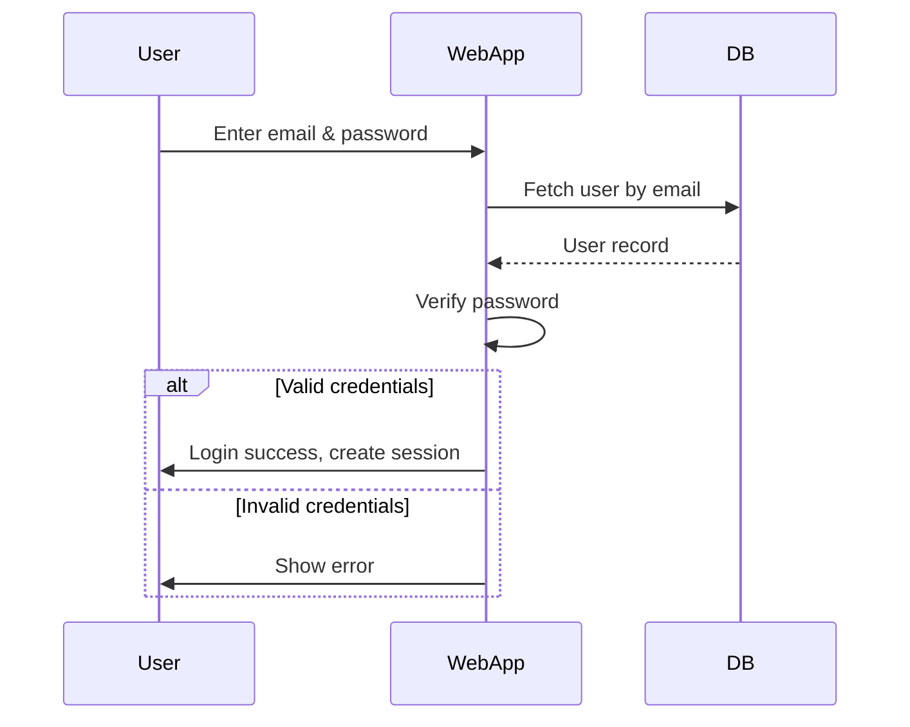
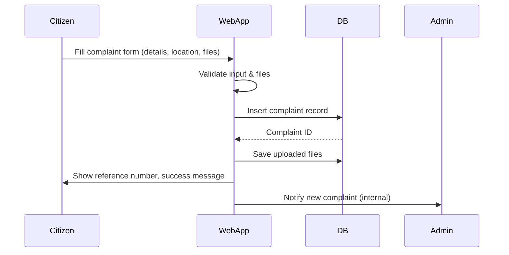
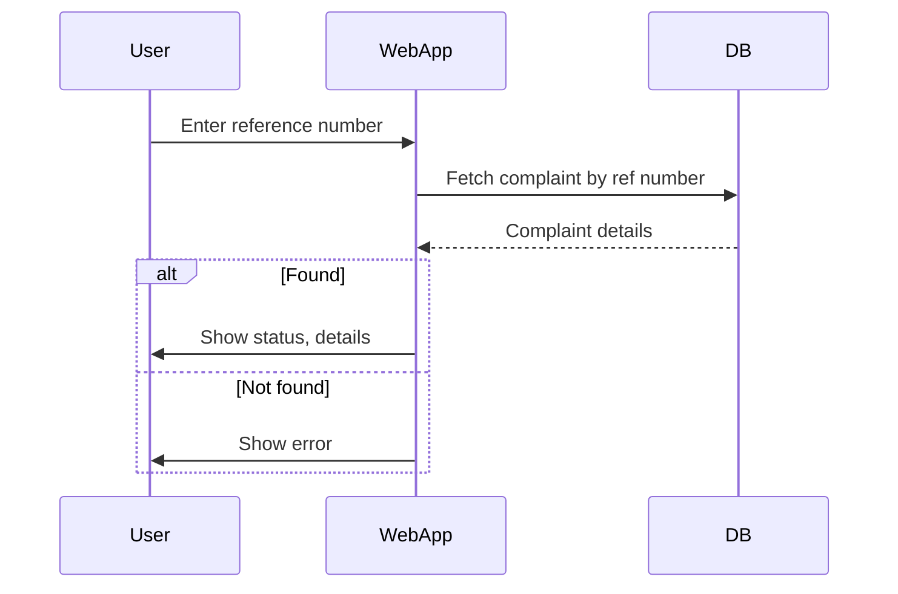
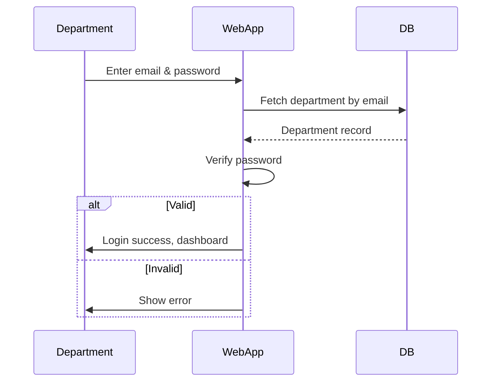
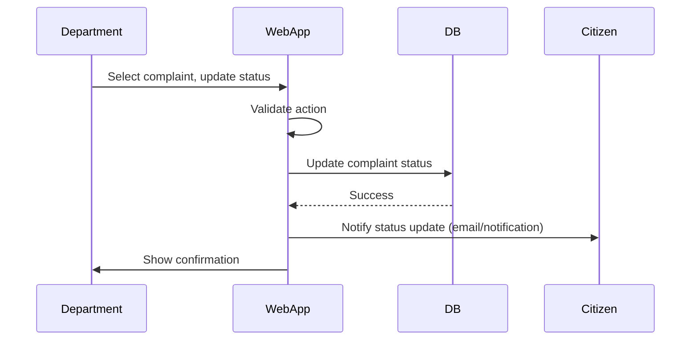
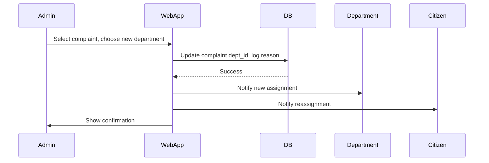
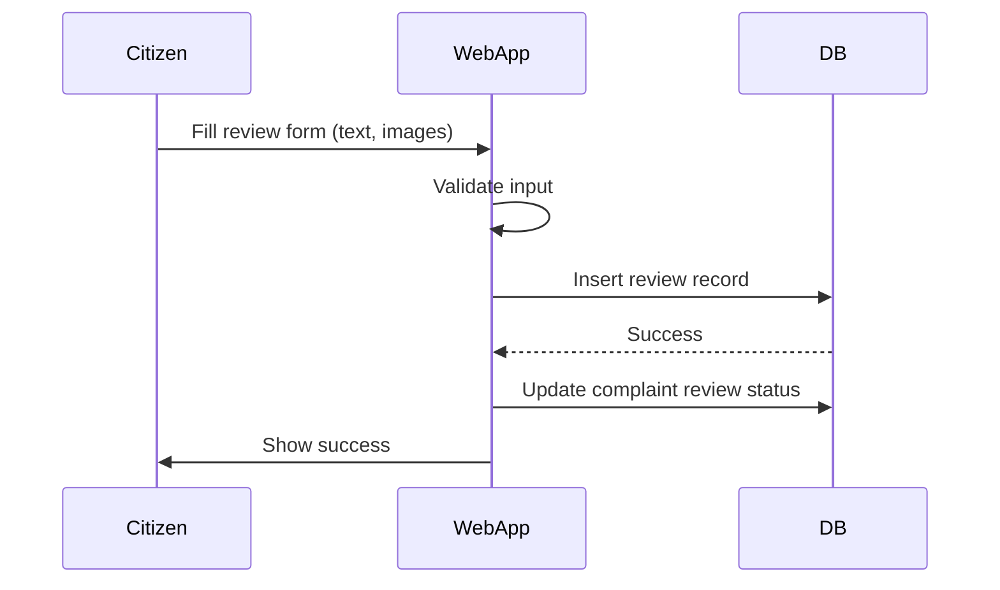
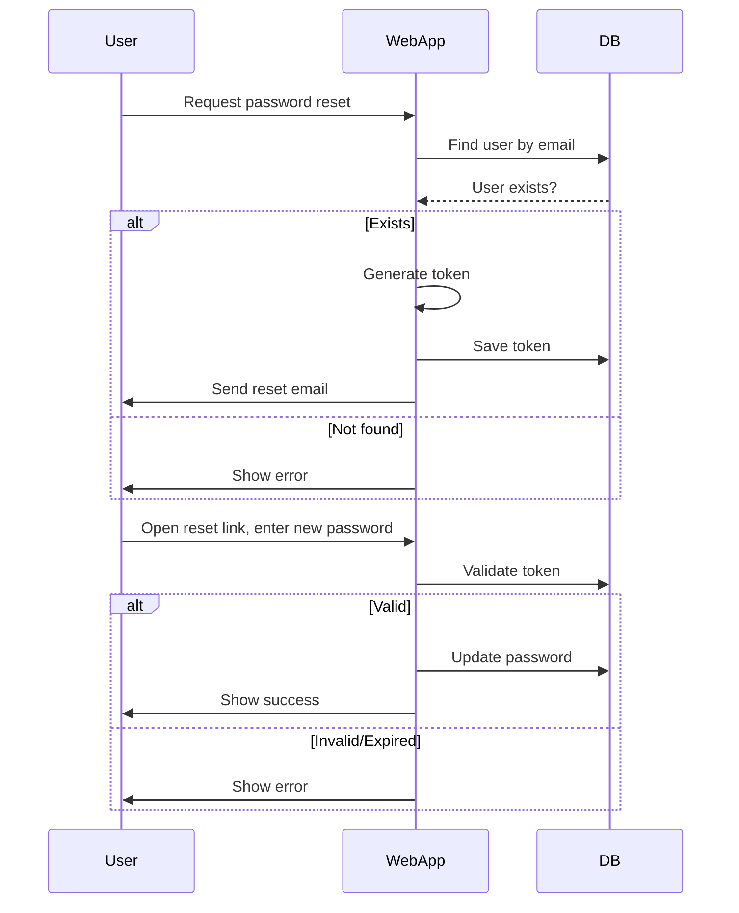
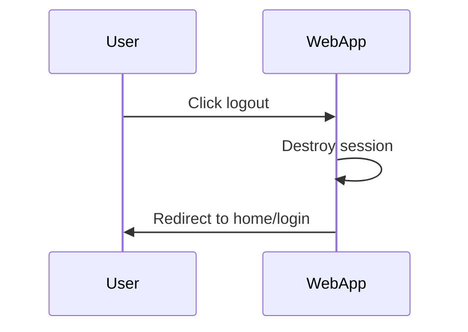

# FixLanka - UML Diagrams

## Overview
This document provides comprehensive UML diagrams for the FixLanka Smart Citizen Complaint & Resolution System, including Class, Use Case, Sequence, and Activity diagrams.

## 1. Class Diagram

```
┌─────────────────────────────────────────────────────────────────────────────┐
│                           FIXLANKA CLASS DIAGRAM                            │
└─────────────────────────────────────────────────────────────────────────────┘

┌─────────────────────────────────────────────────────────────────────────────┐
│                                    User                                     │
├─────────────────────────────────────────────────────────────────────────────┤
│ - user_id: int                                                              │
│ - name: string                                                              │
│ - email: string                                                             │
│ - mobile: string                                                            │
│ - district: string                                                          │
│ - password_hash: string                                                     │
│ - profile_picture: string                                                   │
│ - role: enum (citizen, department, admin)                                  │
│ - created_at: timestamp                                                     │
│ - reset_otp: string                                                         │
│ - reset_otp_expires: datetime                                              │
├─────────────────────────────────────────────────────────────────────────────┤
│ + register()                                                                │
│ + login()                                                                   │
│ + updateProfile()                                                           │
│ + changePassword()                                                          │
│ + resetPassword()                                                           │
│ + logout()                                                                  │
└─────────────────────────────────────────────────────────────────────────────┘
                                │
                                │ 1
                                │
                                ▼
┌─────────────────────────────────────────────────────────────────────────────┐
│                                 Department                                  │
├─────────────────────────────────────────────────────────────────────────────┤
│ - dept_id: int                                                              │
│ - dept_name: string                                                         │
│ - description: text                                                         │
│ - contact_email: string                                                     │
│ - password: string                                                          │
│ - logo: string                                                              │
│ - status: enum (active, inactive)                                          │
│ - created_at: timestamp                                                     │
│ - role: string                                                              │
├─────────────────────────────────────────────────────────────────────────────┤
│ + login()                                                                   │
│ + updateStatus()                                                            │
│ + uploadSolution()                                                          │
│ + viewComplaints()                                                          │
│ + generateReport()                                                          │
└─────────────────────────────────────────────────────────────────────────────┘
                                │
                                │ 1
                                │
                                ▼
┌─────────────────────────────────────────────────────────────────────────────┐
│                                 Complaint                                   │
├─────────────────────────────────────────────────────────────────────────────┤
│ - complaint_id: int                                                         │
│ - user_id: int                                                              │
│ - dept_id: int                                                              │
│ - title: string                                                             │
│ - description: text                                                         │
│ - location_lat: float                                                       │
│ - location_lng: float                                                       │
│ - media_path: string                                                        │
│ - status: enum (Pending, In Progress, Resolved, Rejected)                  │
│ - ref_number: string                                                        │
│ - rejection_reason: text                                                    │
│ - created_at: timestamp                                                     │
├─────────────────────────────────────────────────────────────────────────────┤
│ + submit()                                                                  │
│ + updateStatus()                                                            │
│ + assignDepartment()                                                        │
│ + trackStatus()                                                             │
│ + generateRefNumber()                                                       │
└─────────────────────────────────────────────────────────────────────────────┘
                                │
                                │ 1
                                │
                                ▼
┌─────────────────────────────────────────────────────────────────────────────┐
│                                  Review                                     │
├─────────────────────────────────────────────────────────────────────────────┤
│ - review_id: int                                                            │
│ - user_id: int                                                              │
│ - ref_number: string                                                        │
│ - before_image: string                                                      │
│ - after_image: string                                                       │
│ - review_text: text                                                         │
│ - created_at: datetime                                                      │
├─────────────────────────────────────────────────────────────────────────────┤
│ + submitReview()                                                            │
│ + uploadImages()                                                            │
│ + calculateRating()                                                         │
│ + displayReview()                                                           │
└─────────────────────────────────────────────────────────────────────────────┘

┌─────────────────────────────────────────────────────────────────────────────┐
│                            PasswordResetRequest                             │
├─────────────────────────────────────────────────────────────────────────────┤
│ - id: int                                                                   │
│ - user_id: int                                                              │
│ - username: string                                                          │
│ - email: string                                                             │
│ - description: text                                                         │
│ - requested_password: string                                                │
│ - created_at: datetime                                                      │
│ - read: boolean                                                             │
├─────────────────────────────────────────────────────────────────────────────┤
│ + createRequest()                                                           │
│ + approveRequest()                                                          │
│ + rejectRequest()                                                           │
│ + markAsRead()                                                              │
└─────────────────────────────────────────────────────────────────────────────┘

┌─────────────────────────────────────────────────────────────────────────────┐
│                                 AIModel                                     │
├─────────────────────────────────────────────────────────────────────────────┤
│ - model_id: int                                                             │
│ - model_name: string                                                        │
│ - model_path: string                                                        │
│ - vectorizer_path: string                                                   │
│ - accuracy: float                                                           │
│ - last_trained: datetime                                                    │
│ - status: enum (active, inactive)                                          │
├─────────────────────────────────────────────────────────────────────────────┤
│ + trainModel()                                                              │
│ + predictDepartment()                                                       │
│ + updateModel()                                                             │
│ + evaluateAccuracy()                                                        │
└─────────────────────────────────────────────────────────────────────────────┘

┌─────────────────────────────────────────────────────────────────────────────┐
│                               Notification                                  │
├─────────────────────────────────────────────────────────────────────────────┤
│ - notification_id: int                                                      │
│ - user_id: int                                                              │
│ - type: enum (email, sms, push)                                            │
│ - subject: string                                                           │
│ - message: text                                                             │
│ - status: enum (pending, sent, failed)                                     │
│ - created_at: timestamp                                                     │
├─────────────────────────────────────────────────────────────────────────────┤
│ + sendEmail()                                                               │
│ + sendSMS()                                                                 │
│ + sendPushNotification()                                                    │
│ + updateStatus()                                                            │
└─────────────────────────────────────────────────────────────────────────────┘
```

## 2. Use Case Diagram

```
┌─────────────────────────────────────────────────────────────────────────────┐
│                           FIXLANKA USE CASE DIAGRAM                        │
└─────────────────────────────────────────────────────────────────────────────┘

┌─────────────────────────────────────────────────────────────────────────────┐
│                                 CITIZEN                                     │
└─────────────────────────────────────────────────────────────────────────────┘
         │
         │
         ▼
┌─────────────────────────────────────────────────────────────────────────────┐
│                              Citizen Use Cases                              │
├─────────────────────────────────────────────────────────────────────────────┤
│                                                                             │
│  ┌─────────────────┐    ┌─────────────────┐    ┌─────────────────┐        │
│  │   Register      │    │     Login       │    │  Update Profile │        │
│  │   Account       │    │                 │    │                 │        │
│  └─────────────────┘    └─────────────────┘    └─────────────────┘        │
│                                                                             │
│  ┌─────────────────┐    ┌─────────────────┐    ┌─────────────────┐        │
│  │   Submit        │    │   Track         │    │   Submit        │        │
│  │   Complaint     │    │   Complaint     │    │   Review        │        │
│  └─────────────────┘    └─────────────────┘    └─────────────────┘        │
│                                                                             │
│  ┌─────────────────┐    ┌─────────────────┐    ┌─────────────────┐        │
│  │   Upload        │    │   Change        │    │   Reset         │        │
│  │   Photos        │    │   Password      │    │   Password      │        │
│  └─────────────────┘    └─────────────────┘    └─────────────────┘        │
│                                                                             │
└─────────────────────────────────────────────────────────────────────────────┘

┌─────────────────────────────────────────────────────────────────────────────┐
│                               DEPARTMENT                                    │
└─────────────────────────────────────────────────────────────────────────────┘
         │
         │
         ▼
┌─────────────────────────────────────────────────────────────────────────────┐
│                           Department Use Cases                              │
├─────────────────────────────────────────────────────────────────────────────┤
│                                                                             │
│  ┌─────────────────┐    ┌─────────────────┐    ┌─────────────────┐        │
│  │   Login         │    │   View          │    │   Update        │        │
│  │   Dashboard     │    │   Assigned      │    │   Complaint     │        │
│  │                 │    │   Complaints    │    │   Status        │        │
│  └─────────────────┘    └─────────────────┘    └─────────────────┘        │
│                                                                             │
│  ┌─────────────────┐    ┌─────────────────┐    ┌─────────────────┐        │
│  │   Upload        │    │   Generate      │    │   View          │        │
│  │   Solution      │    │   Reports       │    │   Analytics     │        │
│  │   Photos        │    │                 │    │                 │        │
│  └─────────────────┘    └─────────────────┘    └─────────────────┘        │
│                                                                             │
└─────────────────────────────────────────────────────────────────────────────┘

┌─────────────────────────────────────────────────────────────────────────────┐
│                                 ADMIN                                       │
└─────────────────────────────────────────────────────────────────────────────┘
         │
         │
         ▼
┌─────────────────────────────────────────────────────────────────────────────┐
│                             Admin Use Cases                                 │
├─────────────────────────────────────────────────────────────────────────────┤
│                                                                             │
│  ┌─────────────────┐    ┌─────────────────┐    ┌─────────────────┐        │
│  │   Manage        │    │   Manage        │    │   View          │        │
│  │   Users         │    │   Departments   │    │   System        │        │
│  │                 │    │                 │    │   Analytics     │        │
│  └─────────────────┘    └─────────────────┘    └─────────────────┘        │
│                                                                             │
│  ┌─────────────────┐    ┌─────────────────┐    ┌─────────────────┐        │
│  │   Reassign      │    │   Handle        │    │   Generate      │        │
│  │   Complaints    │    │   Password      │    │   Reports       │        │
│  │                 │    │   Requests      │    │                 │        │
│  └─────────────────┘    └─────────────────┘    └─────────────────┘        │
│                                                                             │
│  ┌─────────────────┐    ┌─────────────────┐    ┌─────────────────┐        │
│  │   Configure     │    │   Monitor       │    │   Backup        │        │
│  │   System        │    │   Performance   │    │   System        │        │
│  │   Settings      │    │                 │    │   Data          │        │
│  └─────────────────┘    └─────────────────┘    └─────────────────┘        │
│                                                                             │
└─────────────────────────────────────────────────────────────────────────────┘

┌─────────────────────────────────────────────────────────────────────────────┐
│                              SYSTEM ACTORS                                  │
└─────────────────────────────────────────────────────────────────────────────┘
         │
         │
         ▼
┌─────────────────────────────────────────────────────────────────────────────┐
│                           System Use Cases                                  │
├─────────────────────────────────────────────────────────────────────────────┤
│                                                                             │
│  ┌─────────────────┐    ┌─────────────────┐    ┌─────────────────┐        │
│  │   AI            │    │   Send          │    │   Store         │        │
│  │   Prediction    │    │   Notifications │    │   Files         │        │
│  │                 │    │                 │    │                 │        │
│  └─────────────────┘    └─────────────────┘    └─────────────────┘        │
│                                                                             │
│  ┌─────────────────┐    ┌─────────────────┐    ┌─────────────────┐        │
│  │   Generate      │    │   Validate      │    │   Log           │        │
│  │   Reference     │    │   Input         │    │   Activities    │        │
│  │   Numbers       │    │   Data          │    │                 │        │
│  └─────────────────┘    └─────────────────┘    └─────────────────┘        │
│                                                                             │
└─────────────────────────────────────────────────────────────────────────────┘
```

## 3. Sequence Diagram - Complaint Submission

```
┌─────────────────────────────────────────────────────────────────────────────┐
│                    COMPLAINT SUBMISSION SEQUENCE DIAGRAM                    │
└─────────────────────────────────────────────────────────────────────────────┘

┌─────────────┐ ┌─────────────┐ ┌─────────────┐ ┌─────────────┐ ┌─────────────┐
│   Citizen   │ │   System    │ │   AI Model  │ │ Department  │ │ Notification│
│             │ │             │ │             │ │             │ │   System    │
└─────────────┘ └─────────────┘ └─────────────┘ └─────────────┘ └─────────────┘
      │               │               │               │               │
      │               │               │               │               │
      │ 1. Submit     │               │               │               │
      │ Complaint     │               │               │               │
      │──────────────▶│               │               │               │
      │               │               │               │               │
      │               │ 2. Validate   │               │               │
      │               │ Input Data    │               │               │
      │               │──────────────▶│               │               │
      │               │               │               │               │
      │               │ 3. Upload     │               │               │
      │               │ Files         │               │               │
      │               │──────────────▶│               │               │
      │               │               │               │               │
      │               │ 4. Generate   │               │               │
      │               │ Ref Number    │               │               │
      │               │──────────────▶│               │               │
      │               │               │               │               │
      │               │ 5. Predict    │               │               │
      │               │ Department    │               │               │
      │               │──────────────▶│               │               │
      │               │               │               │               │
      │               │               │ 6. Analyze    │               │
      │               │               │ Text          │               │
      │               │               │──────────────▶│               │
      │               │               │               │               │
      │               │               │ 7. Return     │               │
      │               │               │ Prediction    │               │
      │               │◀──────────────│               │               │
      │               │               │               │               │
      │               │ 8. Assign     │               │               │
      │               │ Department    │               │               │
      │               │──────────────▶│               │               │
      │               │               │               │               │
      │               │               │               │ 9. Notify     │
      │               │               │               │ Department    │
      │               │──────────────▶│               │               │
      │               │               │               │               │
      │               │ 10. Send      │               │               │
      │               │ Notification  │               │               │
      │               │──────────────▶│               │               │
      │               │               │               │               │
      │               │               │               │               │ 11. Send
      │               │               │               │               │ Email/SMS
      │               │──────────────▶│               │               │
      │               │               │               │               │
      │ 12. Return    │               │               │               │
      │ Success       │               │               │               │
      │◀──────────────│               │               │               │
      │               │               │               │               │
```

## 4. Sequence Diagram - Department Status Update

```
┌─────────────────────────────────────────────────────────────────────────────┐
│                   DEPARTMENT STATUS UPDATE SEQUENCE                        │
└─────────────────────────────────────────────────────────────────────────────┘

┌─────────────┐ ┌─────────────┐ ┌─────────────┐ ┌─────────────┐ ┌─────────────┐
│ Department  │ │   System    │ │ Complaint   │ │   Citizen   │ │ Notification│
│   Staff     │ │             │ │ Database    │ │             │ │   System    │
└─────────────┘ └─────────────┘ └─────────────┘ └─────────────┘ └─────────────┘
      │               │               │               │               │
      │               │               │               │               │
      │ 1. Login      │               │               │               │
      │ Dashboard     │               │               │               │
      │──────────────▶│               │               │               │
      │               │               │               │               │
      │               │ 2. Fetch      │               │               │
      │               │ Complaints    │               │               │
      │               │──────────────▶│               │               │
      │               │               │               │               │
      │               │◀──────────────│               │               │
      │               │               │               │               │
      │ 3. View       │               │               │               │
      │ Assigned      │               │               │               │
      │ Complaints    │               │               │               │
      │◀──────────────│               │               │               │
      │               │               │               │               │
      │ 4. Update     │               │               │               │
      │ Status        │               │               │               │
      │──────────────▶│               │               │               │
      │               │               │               │               │
      │               │ 5. Validate   │               │               │
      │               │ Status        │               │               │
      │               │──────────────▶│               │               │
      │               │               │               │               │
      │               │ 6. Update     │               │               │
      │               │ Database      │               │               │
      │               │──────────────▶│               │               │
      │               │               │               │               │
      │               │◀──────────────│               │               │
      │               │               │               │               │
      │               │ 7. Notify     │               │               │
      │               │ Citizen       │               │               │
      │               │──────────────▶│               │               │
      │               │               │               │               │
      │               │               │               │ 8. Send       │
      │               │               │               │ Notification  │
      │               │──────────────▶│               │               │
      │               │               │               │               │
      │               │               │               │               │ 9. Send
      │               │               │               │               │ Email/SMS
      │               │──────────────▶│               │               │
      │               │               │               │               │
      │ 10. Return    │               │               │               │
      │ Success       │               │               │               │
      │◀──────────────│               │               │               │
      │               │               │               │               │
```

## 5. Activity Diagram - Complaint Lifecycle

```
┌─────────────────────────────────────────────────────────────────────────────┐
│                        COMPLAINT LIFECYCLE ACTIVITY                        │
└─────────────────────────────────────────────────────────────────────────────┘

                    ┌─────────────────┐
                    │   START         │
                    └─────────────────┘
                              │
                              ▼
                    ┌─────────────────┐
                    │ Citizen Login   │
                    └─────────────────┘
                              │
                              ▼
                    ┌─────────────────┐
                    │ Submit          │
                    │ Complaint       │
                    └─────────────────┘
                              │
                              ▼
                    ┌─────────────────┐
                    │ Validate Input  │
                    │ Data            │
                    └─────────────────┘
                              │
                              ▼
                    ┌─────────────────┐
                    │ Upload Photos   │
                    └─────────────────┘
                              │
                              ▼
                    ┌─────────────────┐
                    │ Generate        │
                    │ Reference       │
                    │ Number          │
                    └─────────────────┘
                              │
                              ▼
                    ┌─────────────────┐
                    │ AI Predict      │
                    │ Department      │
                    └─────────────────┘
                              │
                              ▼
                    ┌─────────────────┐
                    │ Assign to       │
                    │ Department      │
                    └─────────────────┘
                              │
                              ▼
                    ┌─────────────────┐
                    │ Send            │
                    │ Notifications   │
                    └─────────────────┘
                              │
                              ▼
                    ┌─────────────────┐
                    │ Status:         │
                    │ PENDING         │
                    └─────────────────┘
                              │
                              ▼
                    ┌─────────────────┐
                    │ Department      │
                    │ Reviews         │
                    │ Complaint       │
                    └─────────────────┘
                              │
                              ▼
                    ┌─────────────────┐
                    │ Status:         │
                    │ IN PROGRESS     │
                    └─────────────────┘
                              │
                              ▼
                    ┌─────────────────┐
                    │ Department      │
                    │ Works on        │
                    │ Issue           │
                    └─────────────────┘
                              │
                              ▼
                    ┌─────────────────┐
                    │ Upload          │
                    │ Solution        │
                    │ Photos          │
                    └─────────────────┘
                              │
                              ▼
                    ┌─────────────────┐
                    │ Status:         │
                    │ RESOLVED        │
                    └─────────────────┘
                              │
                              ▼
                    ┌─────────────────┐
                    │ Notify Citizen  │
                    └─────────────────┘
                              │
                              ▼
                    ┌─────────────────┐
                    │ Citizen         │
                    │ Submits Review  │
                    └─────────────────┘
                              │
                              ▼
                    ┌─────────────────┐
                    │ Upload          │
                    │ Before/After    │
                    │ Photos          │
                    └─────────────────┘
                              │
                              ▼
                    ┌─────────────────┐
                    │ END             │
                    └─────────────────┘
```

## 6. Activity Diagram - User Registration

```
┌─────────────────────────────────────────────────────────────────────────────┐
│                          USER REGISTRATION ACTIVITY                        │
└─────────────────────────────────────────────────────────────────────────────┘

                    ┌─────────────────┐
                    │   START         │
                    └─────────────────┘
                              │
                              ▼
                    ┌─────────────────┐
                    │ Fill            │
                    │ Registration    │
                    │ Form            │
                    └─────────────────┘
                              │
                              ▼
                    ┌─────────────────┐
                    │ Validate        │
                    │ Input Data      │
                    └─────────────────┘
                              │
                              ▼
                    ┌─────────────────┐
                    │ Check Email     │
                    │ Already         │
                    │ Exists?         │
                    └─────────────────┘
                              │
                              ▼
                    ┌─────────────────┐
                    │ Hash Password   │
                    └─────────────────┘
                              │
                              ▼
                    ┌─────────────────┐
                    │ Create User     │
                    │ Account         │
                    └─────────────────┘
                              │
                              ▼
                    ┌─────────────────┐
                    │ Generate        │
                    │ Verification    │
                    │ Token           │
                    └─────────────────┘
                              │
                              ▼
                    ┌─────────────────┐
                    │ Send            │
                    │ Verification    │
                    │ Email           │
                    └─────────────────┘
                              │
                              ▼
                    ┌─────────────────┐
                    │ User Clicks     │
                    │ Verification    │
                    │ Link?           │
                    └─────────────────┘
                              │
                              ▼
                    ┌─────────────────┐
                    │ Activate        │
                    │ Account         │
                    └─────────────────┘
                              │
                              ▼
                    ┌─────────────────┐
                    │ END             │
                    └─────────────────┘
```

## 7. Component Diagram

```
┌─────────────────────────────────────────────────────────────────────────────┐
│                           FIXLANKA COMPONENT DIAGRAM                       │
└─────────────────────────────────────────────────────────────────────────────┘

┌─────────────────────────────────────────────────────────────────────────────┐
│                              PRESENTATION LAYER                             │
├─────────────────────────────────────────────────────────────────────────────┤
│                                                                             │
│  ┌─────────────────┐  ┌─────────────────┐  ┌─────────────────┐            │
│  │  Citizen Portal │  │ Department      │  │  Admin Portal   │            │
│  │                 │  │ Portal          │  │                 │            │
│  │ • HTML/CSS/JS   │  │                 │  │ • Dashboard     │            │
│  │ • Responsive    │  │ • Dashboard     │  │ • User Mgmt     │            │
│  │ • Mobile        │  │ • Complaint     │  │ • Reports       │            │
│  │   Friendly      │  │   View          │  │ • Analytics     │            │
│  └─────────────────┘  │ • Status Update │  └─────────────────┘            │
│                       └─────────────────┘                                 │
└─────────────────────────────────────────────────────────────────────────────┘
                                    │
                                    ▼
┌─────────────────────────────────────────────────────────────────────────────┐
│                              BUSINESS LOGIC LAYER                           │
├─────────────────────────────────────────────────────────────────────────────┤
│                                                                             │
│  ┌─────────────────┐  ┌─────────────────┐  ┌─────────────────┐            │
│  │ Authentication  │  │ Complaint       │  │ AI/ML           │            │
│  │ Component       │  │ Management      │  │ Component       │            │
│  │                 │  │ Component       │  │                 │            │
│  │ • Login/Logout  │  │                 │  │ • Prediction    │            │
│  │ • Registration  │  │ • Submit        │  │ • Model         │            │
│  │ • Password      │  │ • Track         │  │   Training      │            │
│  │   Reset         │  │ • Update        │  │ • Accuracy      │            │
│  └─────────────────┘  └─────────────────┘  └─────────────────┘            │
│                                                                             │
│  ┌─────────────────┐  ┌─────────────────┐  ┌─────────────────┐            │
│  │ Department      │  │ Review          │  │ Notification    │            │
│  │ Management      │  │ System          │  │ Component       │            │
│  │ Component       │  │ Component       │  │                 │            │
│  │                 │  │                 │  │ • Email         │            │
│  │ • Dashboard     │  │ • Submit        │  │ • SMS           │            │
│  │ • Status        │  │   Reviews       │  │ • Push          │            │
│  │   Updates       │  │ • Upload        │  │   Notifications │            │
│  │ • Analytics     │  │   Photos        │  └─────────────────┘            │
│  └─────────────────┘  └─────────────────┘                                 │
└─────────────────────────────────────────────────────────────────────────────┘
                                    │
                                    ▼
┌─────────────────────────────────────────────────────────────────────────────┐
│                                DATA LAYER                                   │
├─────────────────────────────────────────────────────────────────────────────┤
│                                                                             │
│  ┌─────────────────┐  ┌─────────────────┐  ┌─────────────────┐            │
│  │ MySQL Database  │  │ File Storage    │  │ AI Model Files  │            │
│  │                 │  │                 │  │                 │            │
│  │ • Users         │  │ • Images        │  │ • Model.pkl     │            │
│  │ • Complaints    │  │ • Documents     │  │ • Vectorizer.pkl│            │
│  │ • Departments   │  │ • Logos         │  │ • Training Data │            │
│  │ • Reviews       │  │ • Backups       │  │ • Metadata      │            │
│  └─────────────────┘  └─────────────────┘  └─────────────────┘            │
└─────────────────────────────────────────────────────────────────────────────┘
```

## 8. State Diagram - Complaint Status

```
┌─────────────────────────────────────────────────────────────────────────────┐
│                           COMPLAINT STATUS STATE DIAGRAM                   │
└─────────────────────────────────────────────────────────────────────────────┘

                    ┌─────────────────┐
                    │   SUBMITTED     │
                    │                 │
                    │ • Ref Number    │
                    │   Generated     │
                    │ • Department    │
                    │   Assigned      │
                    └─────────────────┘
                              │
                              │ AI Prediction
                              ▼
                    ┌─────────────────┐
                    │   PENDING       │
                    │                 │
                    │ • Awaiting      │
                    │   Department    │
                    │   Review        │
                    └─────────────────┘
                              │
                              │ Department
                              │ Reviews
                              ▼
                    ┌─────────────────┐
                    │  IN PROGRESS    │
                    │                 │
                    │ • Department    │
                    │   Working       │
                    │ • Status        │
                    │   Updates       │
                    └─────────────────┘
                              │
                              │ Issue
                              │ Resolved
                              ▼
                    ┌─────────────────┐
                    │   RESOLVED      │
                    │                 │
                    │ • Solution      │
                    │   Uploaded      │
                    │ • Citizen       │
                    │   Notified      │
                    └─────────────────┘
                              │
                              │ Citizen
                              │ Reviews
                              ▼
                    ┌─────────────────┐
                    │   COMPLETED     │
                    │                 │
                    │ • Review        │
                    │   Submitted     │
                    │ • Before/After  │
                    │   Photos        │
                    └─────────────────┘

                    ┌─────────────────┐
                    │   REJECTED      │
                    │                 │
                    │ • Cannot be     │
                    │   Processed     │
                    │ • Reason        │
                    │   Provided      │
                    └─────────────────┘
```

## 9. Package Diagram

```
┌─────────────────────────────────────────────────────────────────────────────┐
│                           FIXLANKA PACKAGE DIAGRAM                         │
└─────────────────────────────────────────────────────────────────────────────┘

┌─────────────────────────────────────────────────────────────────────────────┐
│                              FIXLANKA SYSTEM                               │
└─────────────────────────────────────────────────────────────────────────────┘
                                    │
                    ┌───────────────┼───────────────┐
                    │               │               │
                    ▼               ▼               ▼
┌─────────────────┐ ┌─────────────────┐ ┌─────────────────┐
│   PRESENTATION  │ │   BUSINESS      │ │     DATA        │
│   PACKAGE       │ │   LOGIC         │ │   PACKAGE       │
│                 │ │   PACKAGE       │ │                 │
└─────────────────┘ └─────────────────┘ └─────────────────┘
         │                       │                       │
         ▼                       ▼                       ▼
┌─────────────────┐ ┌─────────────────┐ ┌─────────────────┐
│ • Citizen UI    │ │ • User Mgmt     │ │ • Database      │
│ • Department UI │ │ • Complaint     │ │   Connection    │
│ • Admin UI      │ │   Processing    │ │ • File Storage  │
│ • Mobile UI     │ │ • AI/ML         │ │ • Backup        │
└─────────────────┘ │ • Notification  │ └─────────────────┘
                    │ • Analytics     │
                    └─────────────────┘
```

## 10. Deployment Diagram

```
┌─────────────────────────────────────────────────────────────────────────────┐
│                           FIXLANKA DEPLOYMENT DIAGRAM                      │
└─────────────────────────────────────────────────────────────────────────────┘

┌─────────────────────────────────────────────────────────────────────────────┐
│                              WEB SERVER                                     │
│                           (Apache/XAMPP)                                   │
├─────────────────────────────────────────────────────────────────────────────┤
│                                                                             │
│  ┌─────────────────┐  ┌─────────────────┐  ┌─────────────────┐            │
│  │  PHP Engine     │  │  Static Files   │  │  Session        │            │
│  │                 │  │                 │  │  Storage        │            │
│  │ • Application   │  │ • CSS           │  │                 │            │
│  │   Logic         │  │ • JavaScript    │  │ • User          │            │
│  │ • Business      │  │ • Images        │  │   Sessions      │            │
│  │   Rules         │  │ • Icons         │  │ • Cache         │            │
│  │ • API Endpoints │  │ • Logos         │  │ • Temporary     │            │
│  └─────────────────┘  └─────────────────┘  │   Data          │            │
│                                            └─────────────────┘            │
└─────────────────────────────────────────────────────────────────────────────┘
                                    │
                                    ▼
┌─────────────────────────────────────────────────────────────────────────────┐
│                              DATABASE SERVER                                │
│                              (MySQL)                                        │
├─────────────────────────────────────────────────────────────────────────────┤
│                                                                             │
│  ┌─────────────────┐  ┌─────────────────┐  ┌─────────────────┐            │
│  │  User Data      │  │  Complaint      │  │  System Data    │            │
│  │                 │  │  Data           │  │                 │            │
│  │ • Accounts      │  │ • Complaints    │  │ • Departments   │            │
│  │ • Profiles      │  │ • Status        │  │ • Reviews       │            │
│  │ • Sessions      │  │ • Assignments   │  │ • Analytics     │            │
│  │ • Passwords     │  │ • History       │  │ • Logs          │            │
│  └─────────────────┘  └─────────────────┘  └─────────────────┘            │
└─────────────────────────────────────────────────────────────────────────────┘
                                    │
                                    ▼
┌─────────────────────────────────────────────────────────────────────────────┐
│                              FILE SERVER                                    │
│                           (Local Storage)                                  │
├─────────────────────────────────────────────────────────────────────────────┤
│                                                                             │
│  ┌─────────────────┐  ┌─────────────────┐  ┌─────────────────┐            │
│  │  Upload Files   │  │  AI Models      │  │  System Files   │            │
│  │                 │  │                 │  │                 │            │
│  │ • Complaint     │  │ • Model.pkl     │  │ • Config Files  │            │
│  │   Photos        │  │ • Vectorizer.pkl│  │ • Log Files     │            │
│  │ • Review        │  │ • Training Data │  │ • Backup Files  │            │
│  │   Images        │  │ • Metadata      │  │ • Temp Files    │            │
│  │ • Profile Pics  │  └─────────────────┘  └─────────────────┘            │
│  └─────────────────┘                                                       │
└─────────────────────────────────────────────────────────────────────────────┘
```

---

# Sequence Diagrams

Below are the main sequence diagrams for the FixLanka system, covering all major user and system interactions.

---

## 1. User Registration


---

## 2. User Login


---

## 3. Submit Complaint


---

## 4. Track Complaint Status


---

## 5. Department Login


---

## 6. Department Updates Complaint Status


---

## 7. Admin Reassigns Complaint


---

## 8. Submit Review


---

## 9. Password Reset


---

## 10. Logout


---

**Note:** These diagrams can be rendered using Mermaid.js or compatible Markdown viewers. They provide a clear, step-by-step visualization of the main interactions in the FixLanka system.

---

**UML Diagrams Version**: 1.0  
**Last Updated**: December 2024  
**Diagrams Included**: Class, Use Case, Sequence, Activity, Component, State, Package, Deployment